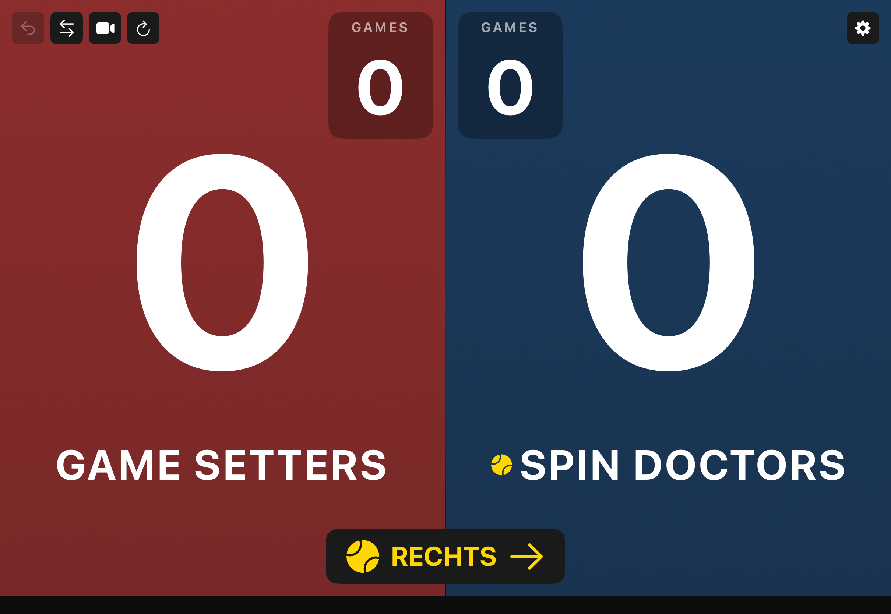
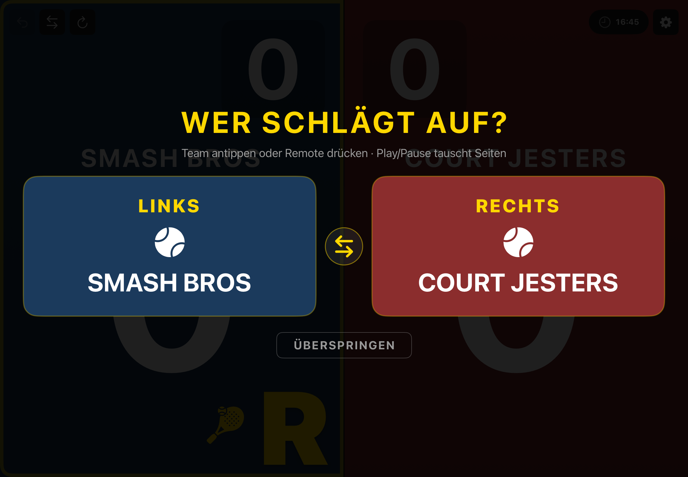
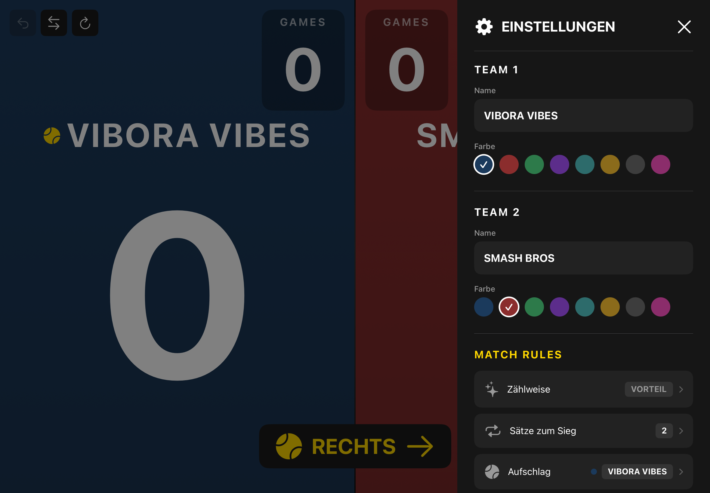

# Padel Pulse — iOS App

<p align="center">
  
  
  
  
</p>

Native iOS scoreboard for padel & tennis. Universal app for iPhone and iPad, landscape-locked, full-screen, designed for courtside use with touch or Bluetooth remote.

<p align="center">
  
</p>

<p align="center">
  
</p>

<p align="center">
  
</p>

---

## Quick Start

```bash
xcodegen generate                    # Generate .xcodeproj from project.yml
open PadelPulse.xcodeproj            # Build & run in Xcode 16+ for iPad
```

Requires iOS 17.0+. Universal app (iPhone + iPad), landscape-only. Camera features require a real device.

### On-device install (USB)

Signing is pinned in `project.yml` (`DEVELOPMENT_TEAM` + `CODE_SIGN_STYLE: Automatic`), so xcodegen regenerations don't wipe it:

```bash
# With iPad connected via USB and unlocked, find its ID:
xcrun devicectl list devices

# Build + install + launch (replace <DEVICE_ID>):
xcodebuild -project PadelPulse.xcodeproj -scheme PadelPulse \
  -destination 'id=<DEVICE_ID>' -configuration Debug -allowProvisioningUpdates build
xcrun devicectl device install app --device <DEVICE_ID> \
  ~/Library/Developer/Xcode/DerivedData/PadelPulse-*/Build/Products/Debug-iphoneos/PadelPulse.app
xcrun devicectl device process launch --device <DEVICE_ID> com.padelpulse.app
```

## Features

### Core Scoring
- Full padel/tennis scoring: 0 / 15 / 30 / 40 / Deuce / AD
- Golden Point mode (no advantage at 40-40)
- Automatic tiebreaks at 6-6
- Configurable sets: 1, 2, 3, or unlimited
- Undo with full history stack

### Display & UX
- **Adaptive layout** — `LayoutMetrics` scales 50+ dimensions from iPhone SE to iPad Pro 13"
- **Giant score display** — readable from across the court
- **Team customization** — custom names + 8 color presets (Navy, Crimson, Forest, Purple, Teal, Amber, Graphite, Rose)
- **Fun random team names** — 30 padel-themed names on each new match
- **Serve indicator** — big gold **L/R letter + racket icon** paired in the court-side corner of the serving panel, plus a pulsing gold border around the whole panel (readable from across the court)
- **Compact set scores** — completed sets as pills in the top-right corner
- **Match timer** — elapsed time from first point
- **Swap sides** — mirror teams when switching court ends

### Premium Features
- **Haptic feedback** — tactile responses for scoring, games, match events
- **Sound effects** — system sounds for points, games, match over (toggleable)
- **Match state persistence** — in-progress match survives app kill and restart
- **Animated match-over** — confetti particles, staggered entrance, winner glow, trophy fly-in
- **Share as image** — rendered 600x315 score card via `ImageRenderer`
- **Onboarding overlay** — first-launch hints, dismissed permanently
- **Serve-pick overlay** — before every fresh match, tap a team tile or press its Bluetooth-remote button to set the first server from the court (toggleable in settings)
- **Camera overlay** — optional PiP camera (opt-in via settings)

### Input
- **Touch** — tap left/right panel to score
- **Bluetooth remote** — Next/Prev Track for scoring, Play/Pause for undo. While the serve-pick overlay is up, the team buttons pick the first server and Play/Pause flips sides (match the iPad's left/right to reality) — full pre-match setup without walking back to the iPad.
- **iPad keyboard** — Cmd+Z (undo), Cmd+N (new match), Cmd+Shift+S (swap), Cmd+, (settings), Arrow keys + Space via GCKeyboard

### Localization
- English, German, Spanish (~95 strings each)
- Runtime language switcher — Auto / EN / DE / ES via Menu in settings, no app restart

## Architecture

```
PadelPulse/
├── App/PadelPulseApp.swift              # @main, scene config, keyboard shortcuts, persistence hooks
├── Models/
│   ├── MatchState.swift                  # MatchState (Codable) + PadelScoring (stateless logic)
│   ├── SavedMatch.swift                  # SavedMatch (Codable) + share text builder
│   └── TeamColor.swift                   # Default colors + Color↔RGB serialization
├── ViewModels/MatchViewModel.swift       # @Observable — state, undo stack, persistence, sound
├── Storage/MatchStorage.swift            # UserDefaults + Codable match history
├── Views/
│   ├── ScoreBoardView.swift              # Root view — panels, toolbar, set pills, overlays
│   ├── TeamPanelView.swift               # Team half — giant score, GAMES box, team name
│   ├── SettingsSidebarView.swift         # Slide-in settings — pill badges, toggles, language Menu
│   ├── MatchHistoryView.swift            # History cards + share (text & image)
│   ├── MatchOverOverlayView.swift        # Confetti, staggered entrance, winner glow, share
│   ├── OnboardingOverlayView.swift       # First-launch hints
│   ├── ServePickOverlayView.swift        # Pre-match "who serves first?" picker (remote-aware)
│   ├── CameraOverlayView.swift           # AVFoundation camera + recording
│   ├── MatchTimerView.swift              # Match timer pill
│   ├── WallClockView.swift               # Current time-of-day pill (HH:mm)
│   ├── CreditsView.swift                 # Upstream repo + icon attribution
│   └── Components/
│       ├── ColorSwatchPicker.swift       # 8-color inline preset picker (cached RGB)
│       ├── ConfettiView.swift            # Canvas + TimelineView particle animation
│       ├── MatchScoreCardView.swift      # 600x315 share card
│       ├── NameFieldView.swift           # Team name text field
│       ├── PadelRacketView.swift         # SVG asset, template-tinted to gold (paired with L/R glyph)
│       └── SetScorePill.swift            # Set score display pill
├── Services/
│   ├── CameraService.swift               # AVCaptureSession management (serial session queue)
│   ├── LanguageService.swift             # Runtime locale override (bundle swizzle + Environment locale)
│   ├── RemoteInputService.swift          # MPRemoteCommandCenter + GCKeyboard (main-thread hops)
│   └── SoundService.swift                # AudioServicesPlaySystemSound + mute toggle
├── Utilities/
│   ├── Constants.swift                   # Colors + LayoutMetrics (50+ scaled properties)
│   ├── DefaultsKeys.swift                # Central registry of every UserDefaults key
│   ├── HapticService.swift               # UIImpactFeedbackGenerator wrappers (+ prepareAll)
│   └── ShareImageRenderer.swift          # ImageRenderer → UIImage
└── Resources/
    ├── Assets.xcassets/                  # AppIcon, LaunchLogo, DarkBg, GoldColor
    ├── en.lproj/Localizable.strings
    ├── de.lproj/Localizable.strings
    └── es.lproj/Localizable.strings
```

## UI Layout

```
+----------------------------+----------------------------+
| [<-][<>][cam][new]         |     14:32  01:23  [gear]   |
|                            |             S1 6:0  S2 4:3 |
|                            |                            |
|   +-------+                |                +-------+   |
|   | GAMES |                |                | GAMES |   |
|   |   3   |                |                |   2   |   |
|   +-------+                |                +-------+   |
|        CHIQUITAS           |       COURT JESTERS        |
|            30              |              15            |
|                            |                            |
|  L🏸                       |                            |
+----------------------------+----------------------------+
     ↑ gold pulsing border around the serving panel
```

- **Top-left:** icon-only toolbar (Undo, Swap, Camera*, New Match) — 44x44pt touch targets
- **Top-right:** Wall clock + Match timer + Settings (same row), completed set pills below
- **Center:** two team panels — team name above giant score, GAMES box at inner corner
- **Serve side:** big gold **L/R letter + racket icon** paired in the court-side corner of the serving panel (L = deuce-side / left, R = ad-side / right), plus a pulsing gold border with rounded outer corners around the whole serving panel. Reduce Motion mutes the pulse.

*Camera button only visible when enabled in settings.

## Tech Stack

- **Swift 5.9** / **SwiftUI** with `@Observable` macro (iOS 17)
- **AVFoundation** for camera preview & video recording
- **UserDefaults + Codable** for match history + in-progress match persistence
- **MPRemoteCommandCenter + GCKeyboard** for Bluetooth remote & keyboard input
- **AudioServicesPlaySystemSound** for sound effects (zero-dependency)
- **ImageRenderer** for share card generation
- **Canvas + TimelineView** for confetti particle animation
- **XcodeGen** for project generation (`project.yml`)

## Running Tests

```bash
xcodegen generate
xcodebuild -project PadelPulse.xcodeproj -scheme PadelPulseTests \
  -destination 'platform=iOS Simulator,name=iPad Pro 11-inch (M5)' test
```

## Notes

- Volume keys cannot be intercepted on iPadOS (OS restriction). Use Media Next/Prev via Bluetooth remote.
- Camera requires a real device (not simulator).
- Universal app (iPhone + iPad), landscape-locked on both devices.
- iPad uses `UIRequiresFullScreen = YES` (no Split View/Slide Over).
- `LayoutMetrics` uses width-only scaling on iPad (preserving original layout) and dual-axis `min(widthScale, heightScale)` on iPhone with per-metric min clamps for readability.
- Launch screen uses `UILaunchScreen` dict in Info.plist (not a storyboard).
- `ScoreBoardButtonStyle` uses ZStack with fixed 44x44 frame for uniform touch targets.
- No network calls, no analytics, no ads, no third-party dependencies.
